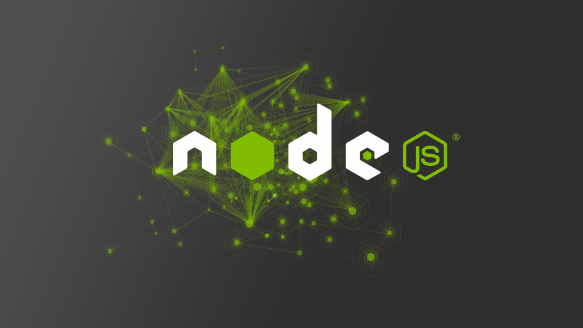
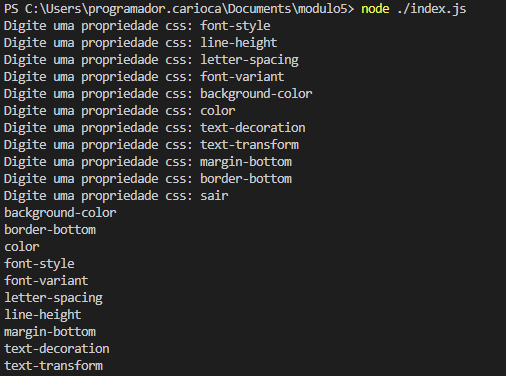

# Projeto Módulo 5 Individual

<h1>🔹 Objetivo do projeto 🔹<h1>
<h5>Usar o Node para montar um código que vai receber uma lista de 
propriedades de CSS (ex: background-color, font-size, text-align) e vai devolver 
essa lista ordenada de A-Z. Ordenar o CSS facilita a encontrar mais rápido a 
propriedade que precisamos alterar.<H5>

➔ O código deve rodar em um laço que vai receber propriedades até a 
pessoa digitar a palavra “SAIR”, quando isso acontecer vai ser impresso 
no terminal a lista das propriedades ordenadas de A-Z uma em cada linha.
<h1>📜 Iniciando o meu projeto 📜<h1>

<h4>Npm init (para iniciar o node).
<h4>Npm install readline-sync (instalando o pacote readline para pegar inputs no terminal).
<h4>Node ./index.js (rodando o codigo).
   
<h1>Demonstração do projeto✔️
  

